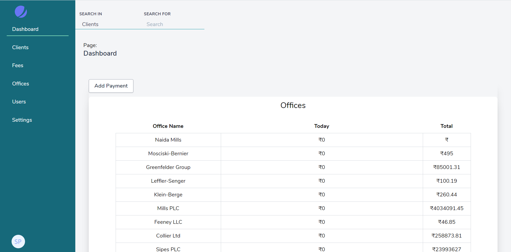
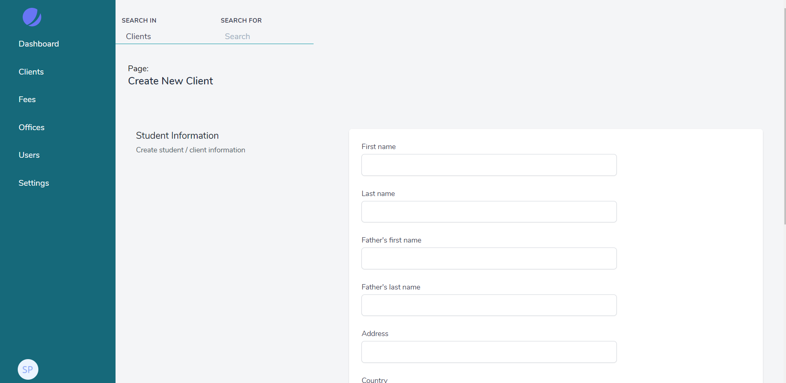
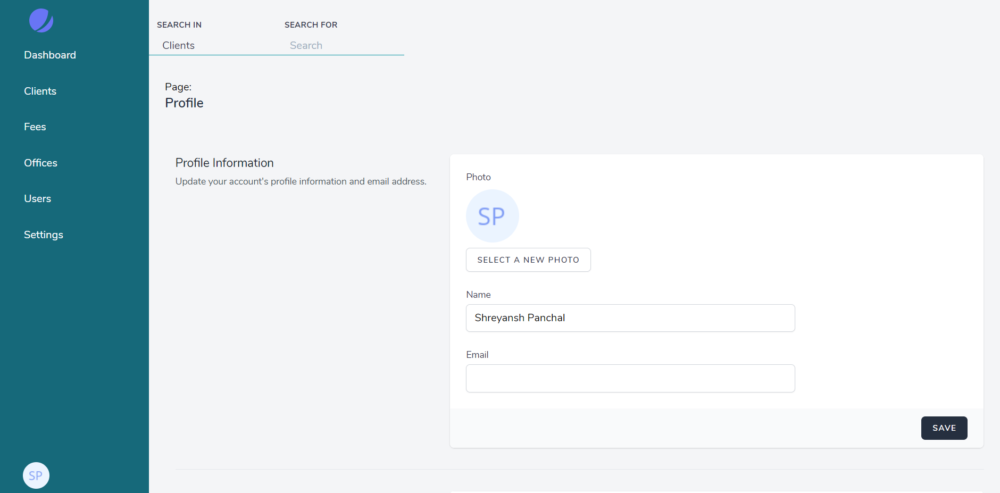

### Summary
This is an example app that integrates Laravel's new addition of JetStream & Inertia JS.

The goal of this application is to provide a guide to how we can make a CRM system through Laravel's adoptation.

#### Installation
- `git clone`
- `composer install`
- `cp .env.example .env`
- Update database configuration in the `.env` file
- `php artisan migrate`
- `php artisan db:seed`
- Install npm dependency with yarn. `yarn install`
- Run yarn script to generate javascript files, `yarn run prod` or `yarn run dev`

#### Testing 
Run static analysis by

```
./vendor/bin/phpstan analyse app
```

#### Screens


---



---


